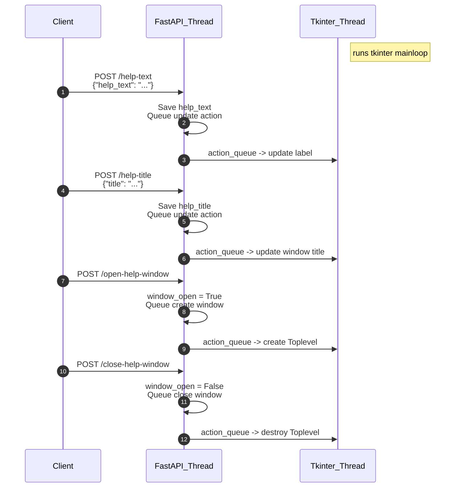

# CS361 Popup Window Microservice

Assignment Repository for Software Engineering I at Oregon State University.

## Help Popup Window Microservice (macOS)

This microservice opens a native popup window on macOS using Tkinter. It exposes four REST endpoints so you can set:
1. Help text
2. Help title
3. Open the popup window
4. Close the popup window

The GUI logic runs in a separate thread from the FastAPI app, ensuring the API remains responsive.

## Requirements

- macOS with a functioning GUI environment.
- Python 3 with Tkinter installed.
- [Homebrew](https://brew.sh) + `brew install tcl-tk`
  - Optional, if you lack Tkinter. Included by default on most systems. Try without first, if you get an error like `No module named '_tkinter'` you will need to install it manually.
  - If you see a message that ends with something like, `Your system is not configured for tk` then run `brew install python-tk`.

## Installation & Usage

1. **Install dependencies**:

```bash
pip install -r requirements.txt
```

2. **Run the microservice**:

```bash
python popup/main.py
```

3. The API defaults to `http://localhost:8000`.

## API Endpoints

### 1. Set Help Text
- **Method**: `POST`
- **Endpoint**: `/help-text`
- **Payload**:
```json
{
"help_text": "This is the help text for the popup window."
}
```
- **Response**:
```json
{
  "message": "Help text set successfully.",
  "help_text": "This is the help text for the popup window."
}
```

#### Example call (python)

```python
import requests
import json

url = "http://localhost:8000/help-text"
data = {"help_text": "This is the help text for the popup window."}

response = requests.post(url, json=data)
if response.status_code == 200:
    result = response.json()
    print(f"Response: {result}")
elif response.status_code == 404:
    error = response.json().get("detail", "Unknown error")
    print(f"Error: {error}")
```

### 2. Set Help Title
- **Method**: `POST`
- **Endpoint**: `/help-title`
- **Payload**:
```json
{
  "title": "My Help Window"
}
```
- **Response**:
```json
{
  "message": "Help title set successfully.",
  "help_title": "My Help Window"
}
```

#### Example call (python)

```python
import requests
import json

url = "http://localhost:8000/help-title"
data = {"title": "My Help Window"}

response = requests.post(url, json=data)
if response.status_code == 200:
    result = response.json()
    print(f"Response: {result}")
elif response.status_code == 404:
    error = response.json().get("detail", "Unknown error")
    print(f"Error: {error}")

```

### 3. Open Help Window
- **Method**: `POST`
- **Endpoint**: `/open-help-window`
- **Response**:
```json
{
  "message": "Help window is now open.",
  "title": "My Help Window",
  "help_text": "This is the help text for the popup window."
}
```

#### Example call (python)

```python
import requests
import json

url = "http://localhost:8000/open-help-window"

response = requests.post(url)
if response.status_code == 200:
    result = response.json()
    print(f"Response: {result}")
elif response.status_code == 404:
    error = response.json().get("detail", "Unknown error")
    print(f"Error: {error}")
```


### 4. Close Help Window
- **Method**: `POST`
- **Endpoint**: `/close-help-window`
- **Response**:
```json
{
  "message": "Help window is now closed."
}
```

#### Example call (python)

```python
import requests
import json

url = "http://localhost:8000/close-help-window"

response = requests.post(url)
if response.status_code == 200:
    result = response.json()
    print(f"Response: {result}")
elif response.status_code == 404:
    error = response.json().get("detail", "Unknown error")
    print(f"Error: {error}")
```


## Running the Tests

```
python tests/test.py
```

## UML Sequence Diagram


